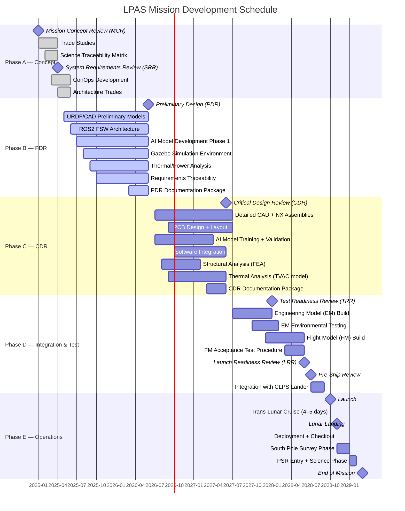

# LPAS Project Schedule
**Document:** LPAS-SCHED-001 | **Revision:** PDR-A

---

## Program Milestone Timeline

---

## Key Milestones

| Milestone | Date | Description |
|-----------|------|-------------|
| MCR | Jan 2025 | Mission Concept Review — scope approved |
| SRR | Apr 2025 | System Requirements Review — requirements baselined |
| **PDR** | **Jun 2026** | **Preliminary Design Review — architecture approved** |
| CDR | Jun 2027 | Critical Design Review — design frozen |
| TRR | Jan 2028 | Test Readiness Review — test procedures approved |
| LRR | Jun 2028 | Launch Readiness Review |
| Launch | Oct 2028 | CLPS launch vehicle (Falcon 9 or Vulcan Centaur) |
| Landing | Nov 2028 | Lunar south pole landing |
| EOM | Mar 2029 | End of primary mission (120 sols) |

---

## Level-of-Effort Summary (Person-Months)

| WBS | Task | Phase A | Phase B | Phase C | Phase D | Total |
|-----|------|---------|---------|---------|---------|-------|
| 1.0 | Project Management | 6 | 12 | 12 | 8 | **38** |
| 2.0 | Systems Engineering | 8 | 18 | 15 | 6 | **47** |
| 3.1 | Chassis & Mobility | 4 | 16 | 20 | 12 | **52** |
| 3.2 | Power System | 3 | 12 | 16 | 8 | **39** |
| 3.3 | Thermal Control | 3 | 10 | 14 | 6 | **33** |
| 3.4 | Avionics & FSW | 6 | 24 | 28 | 14 | **72** |
| 3.5 | Communications | 3 | 10 | 12 | 6 | **31** |
| 3.6 | Science Payload | 5 | 14 | 18 | 10 | **47** |
| 4.0 | Ground System | 2 | 8 | 10 | 8 | **28** |
| 5.0 | I&T | 0 | 4 | 8 | 24 | **36** |
| 6.0 | Mission Ops | 0 | 4 | 8 | 16 | **28** |
| | **TOTAL** | **40** | **132** | **161** | **118** | **451 PM** |
